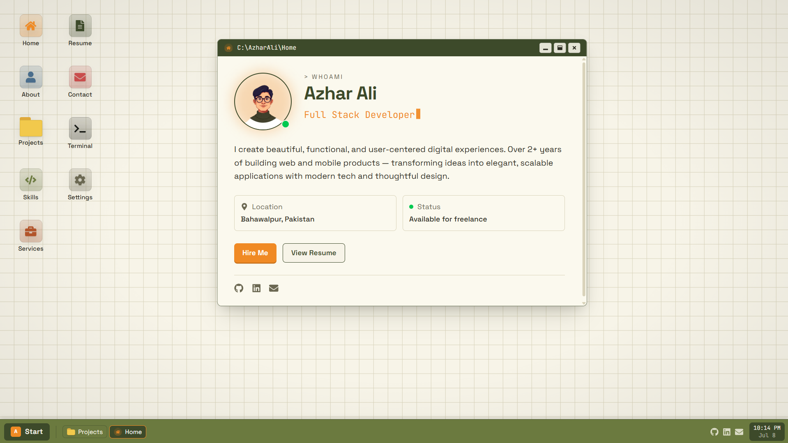

# AzharOS — Interactive Portfolio Desktop

> A portfolio disguised as a lightweight retro operating system.
> Boot it up, drag the icons, open a terminal, list my projects — then close the browser tab like it was a whole computer.



---

## Live

- Preview: open the deployed URL and wait for the boot sequence.
- Local: `bun install && bun run dev` — then visit `http://localhost:8080`.

---

## Why this exists

Most developer portfolios are a scroll and a hero. This one is a **desktop you can actually use** — windows, a taskbar, a Start menu, a working terminal, right-click menus, wallpapers, keyboard shortcuts, and a fake `C:\AzharAli` filesystem where every file opens the app that owns it.

It's a resume, a play space, and a technical demo — all rendered in one screen.

---

## Feature tour

| Area | What's inside |
| ---- | ------------- |
| **Boot** | Cold-boot animation before the desktop appears |
| **Desktop** | Draggable, grid-snapping icons over a parallax wallpaper |
| **Windows** | Drag / resize / minimize / maximize / focus stacking, `react-rnd` powered |
| **Taskbar** | Live clock, running-window list, quick socials |
| **Start Menu** | App launcher, socials, shutdown animation |
| **Terminal** | `help`, `projects`, `skills`, `contact`, `neofetch`, `theme`, `date`, tab-complete, arrow-key history |
| **Right-click** | Refresh, open terminal, wallpaper submenu, close-all-windows, reset layout |
| **Command Palette** | `Ctrl + K` fuzzy launcher |
| **Settings** | Accent color, wallpaper, icon size, cursor style, animation speed, sound, theme |
| **Parallax** | Wallpaper drifts subtly with your mouse |
| **Custom cursor** | Retro or dot variants that react on hover |
| **Persistence** | Icons, theme, and every setting saved to `localStorage` |
| **Projects app** | Live GitHub feed for [`azhar0i0`](https://github.com/azhar0i0) |

### Keyboard shortcuts

| Key | Action |
| --- | --- |
| `Ctrl + K` | Command palette |
| `Alt + Tab` | Cycle windows |
| `Ctrl + M` | Minimize active window |
| `Esc` | Close active window / palette / menu |
| `Enter` | Open focused desktop icon |

---

## Stack

- **Framework** — [TanStack Start](https://tanstack.com/start) (React 19, Vite 7)
- **Language** — TypeScript (strict)
- **Styling** — Tailwind CSS v4 with a custom paper/olive design system
- **State** — [Zustand](https://zustand-demo.pmnd.rs/) with `persist` middleware
- **Windows** — [`react-rnd`](https://github.com/bokuweb/react-rnd)
- **Motion** — Framer Motion
- **Icons** — `react-icons`

---

## Project structure

```
src/
├── routes/                  TanStack Start file-based routes
│   ├── __root.tsx           shell, fonts, favicon
│   └── index.tsx            mounts <Desktop />
├── components/
│   ├── desktop/             Desktop, Window, Taskbar, StartMenu,
│   │                        ContextMenu, CommandPalette, BootScreen
│   └── apps/                Home, About, Projects, Skills, Services,
│                            Contact, Resume, Terminal, Settings
├── lib/desktop/
│   ├── store.ts             Zustand stores: windows, icons, settings
│   └── apps.tsx             App registry + metadata
├── assets/                  Avatar
└── styles.css               Design tokens, wallpapers, custom cursor
```

---

## Design system

Everything is a semantic token — never a hardcoded color.

| Token | Value |
| ----- | ----- |
| `--paper` | warm off-white base |
| `--olive` / `--olive-dark` | primary taskbar & window chrome |
| `--orange` | accent (rebindable at runtime from Settings) |
| `--ink` / `--ink-soft` | text |
| `--folder` / `--folder-tab` | classic yellow folder icon |

Change the accent in Settings and every ring, chip, cursor, and highlight updates live.

---

## Extend

Add a new app in three steps:

1. Drop `MyApp.tsx` in `src/components/apps/`.
2. Register it in `src/lib/desktop/apps.tsx` and add its ID to `AppId` in `src/lib/desktop/store.ts`.
3. Add a default icon position in `DEFAULT_ICONS`.

The window manager, taskbar entry, terminal command, and command palette pick it up automatically.

---

## Credits

Designed & built by **Azhar Ali** — [GitHub](https://github.com/azhar0i0) · [LinkedIn](https://www.linkedin.com/in/skibidi-azhar) · azharisworking@gmail.com

Inspired by Windows 95/XP, macOS System 7, and every developer who ever missed the sound of a startup chime.
